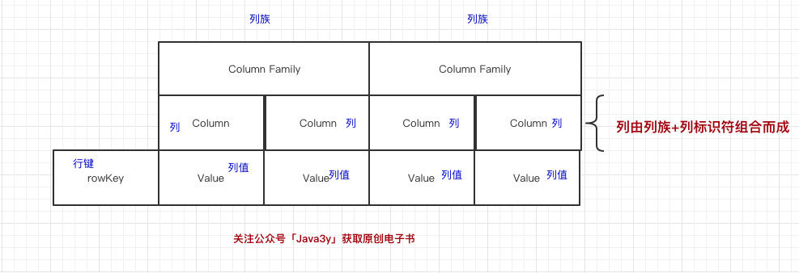
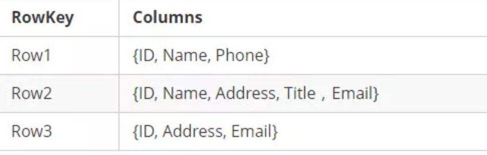
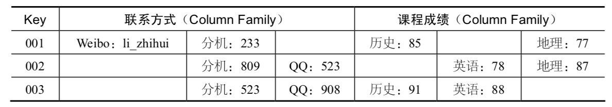

## HBase
非关系型数据库，本质上是一个强化版的key-value数据库，通常的kv数据库存储的数据形式是<key, value, version>，而Hbase的数据形式是<[row key, column family: column key], value, version>，即key中添加了column family等概念，使得key包括了row key与column两个部分，所以HBase不是列数据库，你可以叫它列簇数据库
### HBase是什么？
HBase是Hadoop生态体系中的数据库，分布式、面向列式的
不同于Mysql，Mysql是**单机**的，Mysql能存储多少数据，就取决于它所属服务器的硬盘大小。一个系统，假如一天就能生产1TB的数据，数据量太过庞大，是不适合存Mysql的（现在的普遍做法是先把数据写到Kafka，然后再持久化落到Hive中）  
>**hive之于hbase，就像数据库中的视图之于表的关系**，数据物理存储于表中，视图只是一个或多个表组合而成的结果集，是**虚拟的内存表，不占物理存储空间**，一般视图用于select操作，当然也存在用于update的视图，视图主要还是用于多表连接浏览；更加用户，隔着视图，用户无法直接接触数据表、了解表结构

HBase是依赖Hadoop的，HBase是在HDFS（分布式文件系统）的基础之上构建的，HBase提供了HDFS不具备的**高并发随机写**和**支持实时查询**的能力  
### 列式存储
传统关系性数据库一般是面向行的，那么面向列是什么样子？
````js
// 面向行
id name age sex
1  小明  24  
2  小红      女

// 面向列
id:1   name:小明
id:1   age:24
id:2   name:小红
id:2   sex:女
````
上述这个例子，面向列就是把每列单抽出来 关联上id，这种存储结构非常像**key-value**
>好处？观察面向行的，你会发现一行数据有些是空缺的，但是数据库还是得花费空间去存储；现在全部拆开变成面向列的，那就是有什么就存什么，**空间就可以被充分利用** 
### HBase数据模型
注意：HBase里边也有表、行、列的概念  
一行数据是由一个行键（RowKey)、一或多个相关的列以及它的值组成  
* RowKey是定位每行数据的唯一标识，而HBase的列并不是我们在关系型数据库中想象的那个列  
* 列（Column)是归属于列族（Column Family)中，列修饰符（Column Qualifier 来标识每个列），**先有列族后有列**  



**HBase表的每一行中，列的组成都是灵活的，行与行之间的列可以不同**

  
一个列族下，也可以添加任意列，不受任何限制  
数据写到HBase的时候都会被记录时间戳，这个时间戳会被当作属于数据的一个版本，**当我们修改或者删除某一条的时候，本质上是往里边新增一条数据**，记录的版本加了1而已。旧的数据依旧会被存储，数据库读的时候是读最新的 

### HBase的Key-Value  
Key是 RowKey(行键) + ColumnFamily(列族) + Column Qualifier(列修饰符) + TimeStamp(时间戳，版本) + KeyType(类型组成)，而Value就是实际上的值  
上面也讲到，我们在HBase中修改一条数据其实就是在原来的基础上增加一个版本，定位到这条数据 RowKey + Column + TimeStamp即可  
KeyType是什么？如果是删除数据，实际上却是增加一条数据，为了标识删除这个操作，我们将KeyType设置为"Delete"即可  


